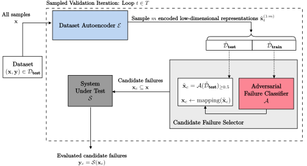

# WeaknessRecognition.jl

### Adversarial Weakness Recognition for Efficient Black-Box Validation
Final project for [CS230: Deep Learning](https://cs230.stanford.edu/) (Robert Moss: mossr@cs.stanford.edu), consulting with Bernard Lange, who's taking [CS330: Meta Learning](https://cs330.stanford.edu/).

## Abstract
> When validating a black-box system, exhaustively evaluating over the entire validation dataset may be computationally intractable. The challenge then becomes to intelligently automate selective validation given knowledge of the system failures experienced so far. We propose an adaptive black-box validation framework that will learn system weaknesses over time and exploit this knowledge to propose validation samples that will likely result in a failure. We use a low-dimensional encoded representation of inputs to train an adversarial failure classifier to intelligently select candidate failures to evaluate. Experiments were run to test our approach against a random candidate selection process and we also compare against full knowledge of the true system failures. We stress test a black-box neural network classifier trained on the MNIST dataset. Results show that using our framework, the adversarial failure classifier selects failures about 3 times more often than random.

## Paper and Presentation
- **Paper**: [Adversarial Weakness Recognition for Efficient Black-Box Validation](./pdf/paper_adversarial_weakness_recognition_for_efficient_black_box_validation.pdf)
- **Presentation**:
    - [Slides](./pdf/slides_adversarial_weakness_recognition_for_efficient_black_box_validation.pdf)
    - [Video](https://youtu.be/AhohhNu77dM)

## Diagram


## Installation
Open `julia` from the root directory, go into the package mode using `]` and run:
```julia
dev .
```
then you can run
```julia
using WeaknessRecognition
```

## Running
Run the [`src/run.jl`](./src/run.jl) file to load the models and call the main `sampled_validation_iteration` loop.
